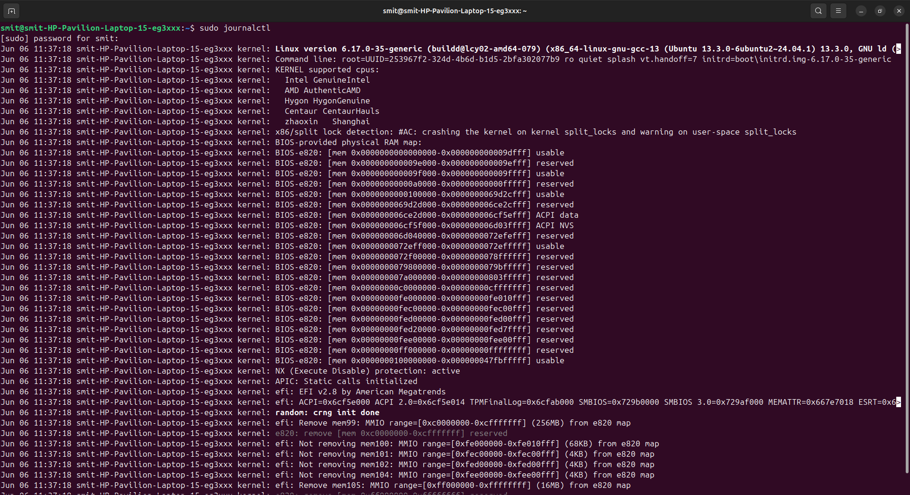
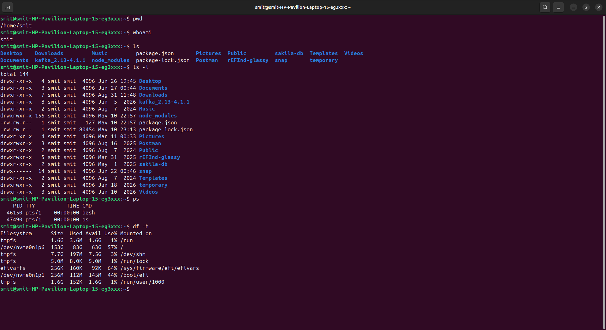

# Linux Homework

## Task 1: Soft Link and Hard Link

A **soft link** is like a shortcut to another file. If the original file is deleted, the soft link will not work.

To create a soft link:

```bash
ln -s original.txt softlink.txt
```

To delete it:

```bash
rm softlink.txt
```

A **hard link** is another link to the same file. Both files have the same inode.

To create a hard link:

```bash
ln original.txt hardlink.txt
```

To check the inode:

```bash
ls -li
```

To delete it:

```bash
rm hardlink.txt
```

The main difference is that a soft link points to the file name/path, while a hard link points to the same inode. If the original file is deleted, the soft link becomes broken, but the hard link will still work.

Soft links can also point to directories and can work across different filesystems, while hard links normally cannot.

---

## Task 2: adduser vs useradd

`useradd` is a command used to create a new user. It is more of a basic/low-level command and we normally need to give options depending on what we want.

Example:

```bash
sudo useradd -m testuser
```

The `-m` option creates the home directory for the user.

`adduser` is easier to use because it is interactive and asks for the information while creating the user.

Example:

```bash
sudo adduser testuser
```

On Ubuntu, I would prefer **adduser** for creating a normal user because it is easier and handles most of the setup for us.

To check the user:

```bash
id testuser
```

To delete the test user:

```bash
sudo deluser testuser
```

So basically, `adduser` is easier for normal user creation, while `useradd` is useful when we want more control or when using scripts.

---

## Task 3: journalctl

`journalctl` is used to check system logs in Linux. It is useful when we want to find errors or check what happened with a service.

To see the logs:

```bash
sudo journalctl
```

To see the latest 50 logs:

```bash
sudo journalctl -n 50
```

To see logs from the current boot:

```bash
sudo journalctl -b
```

We can also check the logs of a particular service. For example, SSH:

```bash
sudo journalctl -u ssh
```

To watch the logs continuously:

```bash
sudo journalctl -u ssh -f
```

The `-u` option is used to specify a service. The `-f` option keeps showing new logs as they come.

I can use `journalctl` when a service is not working properly and I want to find the error from the logs.



---

## Task 4: Linux Command Cheat Sheet

Some important Linux commands I practiced are:

`pwd` - shows where I am currently working.

```bash
pwd
```

`ls` - shows files and folders.

```bash
ls
ls -la
```

`cd` - used to move to another directory.

```bash
cd /home
```

`mkdir` - creates a new directory.

```bash
mkdir test
```

`touch` - creates a new empty file.

```bash
touch file.txt
```

`cp` - copies a file.

```bash
cp file.txt backup.txt
```

`mv` - moves or renames a file.

```bash
mv file.txt newfile.txt
```

`rm` - deletes a file.

```bash
rm file.txt
```

`cat` - displays the contents of a file.

```bash
cat file.txt
```

`grep` - searches for something inside a file.

```bash
grep "error" file.txt
```

`whoami` - shows the current logged-in user.

```bash
whoami
```

`id` - shows information about the user.

```bash
id
```

`chmod` - changes file permissions.

```bash
chmod 755 script.sh
```

`chown` - changes the owner of a file.

```bash
sudo chown user file.txt
```

`ps` - shows running processes.

```bash
ps aux
```

`top` - shows running processes and system usage.

```bash
top
```

`df -h` - shows disk space.

```bash
df -h
```

`free -h` - shows memory usage.

```bash
free -h
```

`ip addr` - shows network information.

```bash
ip addr
```

`ping` - checks if a system/network is reachable.

```bash
ping 8.8.8.8
```

`systemctl` - is used to manage services.

```bash
systemctl status ssh
```

