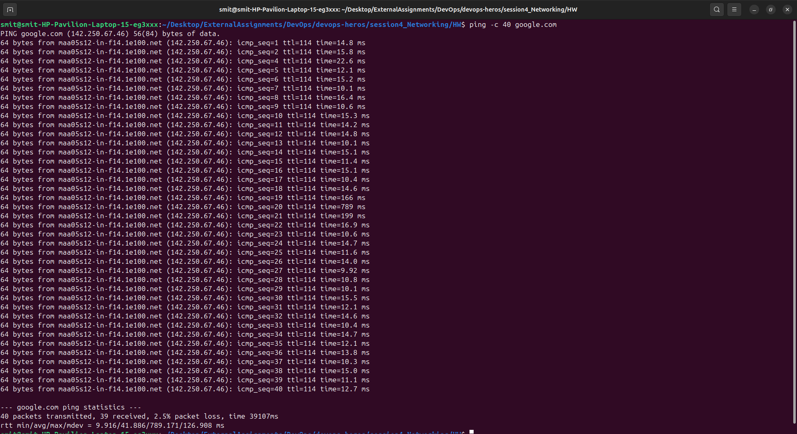
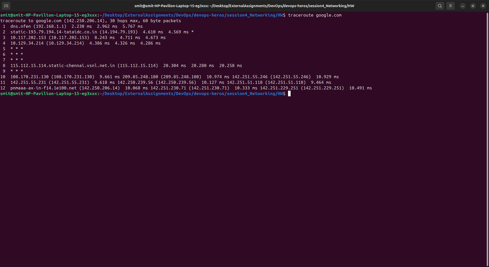
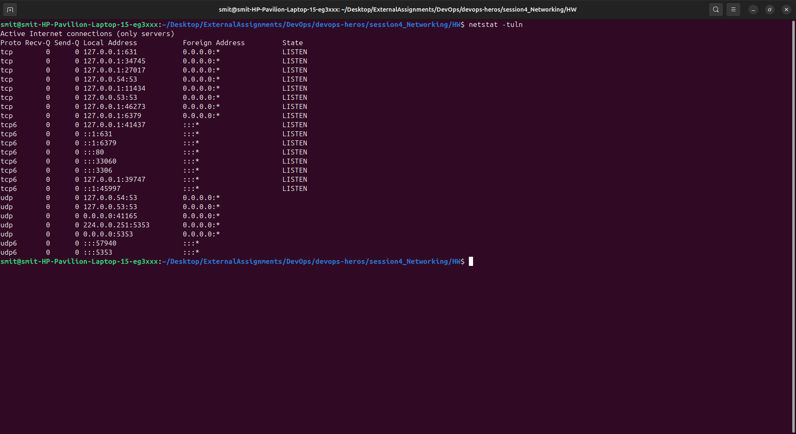
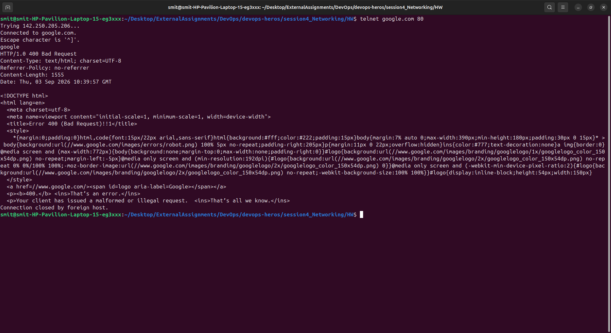
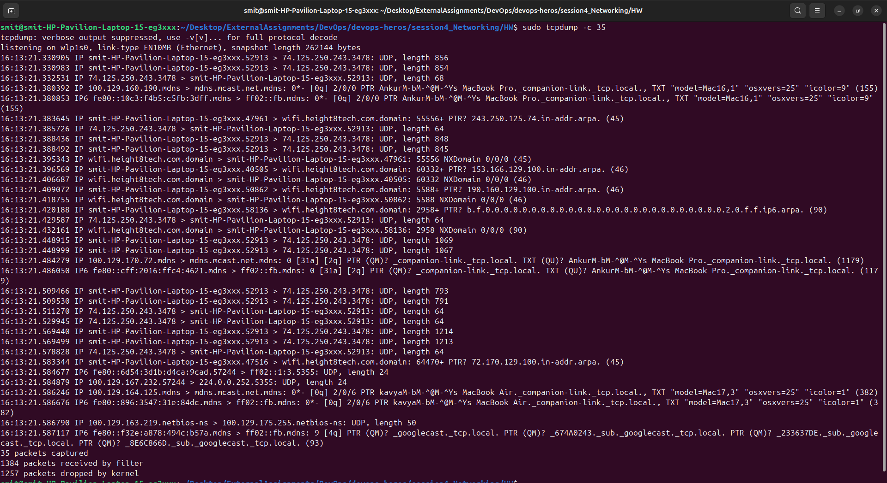
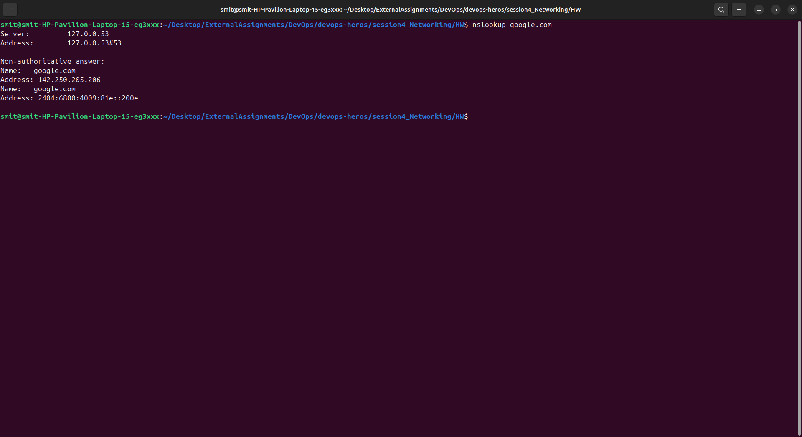
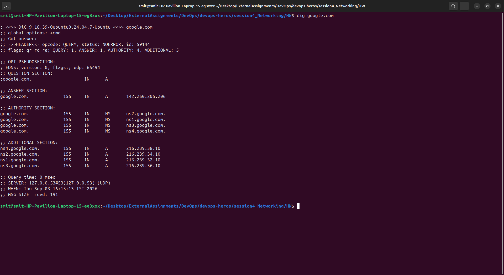
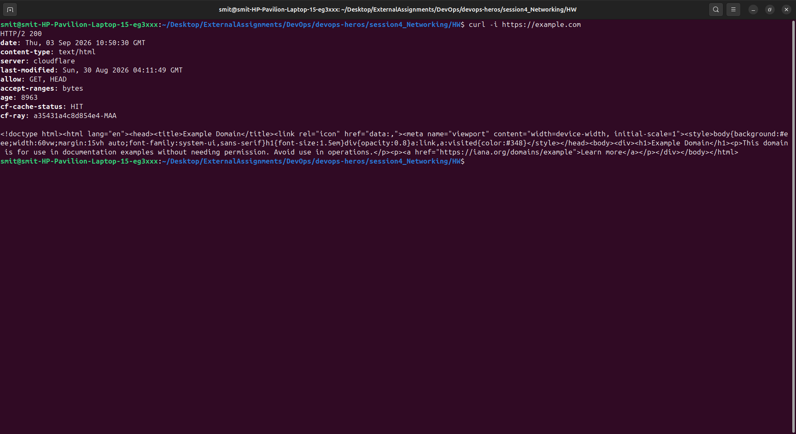
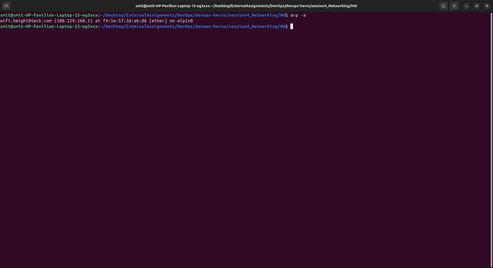
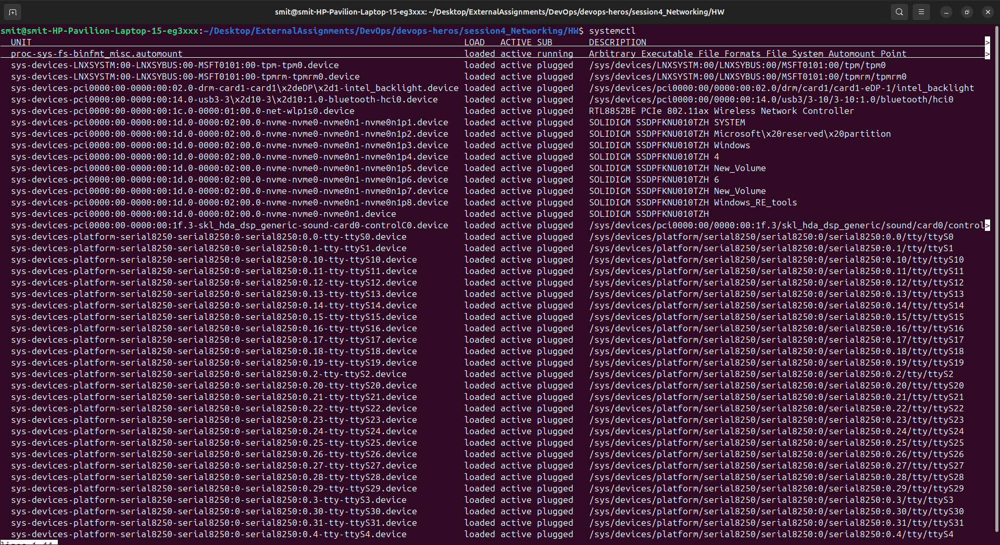

# Running the Network Commands

## ping

`ping` is used to check whether another computer or server is reachable through the network. It also shows the response time.

```bash
ping -c 40 google.com
```



I understood that `ping` is mainly used to check network connectivity.

---

## traceroute

`traceroute` shows the different network devices (hops) that packets pass through to reach a destination.

```bash
traceroute google.com
```



I understood that it helps us find where a network connection is going or where it might be having a problem.

---

## netstat

`netstat` is used to check network connections, open ports and network statistics.

```bash
netstat -tuln
```



I understood that `netstat` can be used to check which ports are listening on the system and view network connections.

---

## telnet

`telnet` can be used to connect to a remote system or check whether a particular port is accessible.

```bash
telnet google.com 80
```



I understood that telnet can be useful for testing whether a specific port is open, although it is not recommended for secure remote login because it does not encrypt the connection.

---

## tcpdump

`tcpdump` is used to capture and display network packets going through a network interface.

```bash
sudo tcpdump
```



I understood that `tcpdump` is useful for checking and troubleshooting network traffic.

---

## nslookup

`nslookup` is used to find DNS information for a domain name.

```bash
nslookup google.com
```



I understood that it can be used to check which IP address a domain name is pointing to and troubleshoot DNS problems.

---

## dig

`dig` is also used to get DNS information. It gives more detailed information compared to `nslookup`.

```bash
dig google.com
```



I understood that `dig` is mainly useful for detailed DNS troubleshooting and checking different DNS records.

---

## curl

`curl` is used to send requests to URLs and transfer data over the network.

```bash
curl https://example.com
```



I understood that `curl` can be used to test websites, APIs and HTTP/HTTPS connections.

---

## arp

`arp` is used to view the mapping between IP addresses and MAC addresses on the local network.

```bash
arp -a
```



I understood that ARP helps a computer find the MAC address associated with an IP address on the local network.

---

## systemctl

`systemctl` is used to manage services on systems that use systemd.

```bash
systemctl status ssh
```



It can also be used to start, stop and restart services.

```bash
sudo systemctl start ssh
sudo systemctl stop ssh
sudo systemctl restart ssh
```

I understood that `systemctl` is mainly used to check and manage services running on a Linux system.
