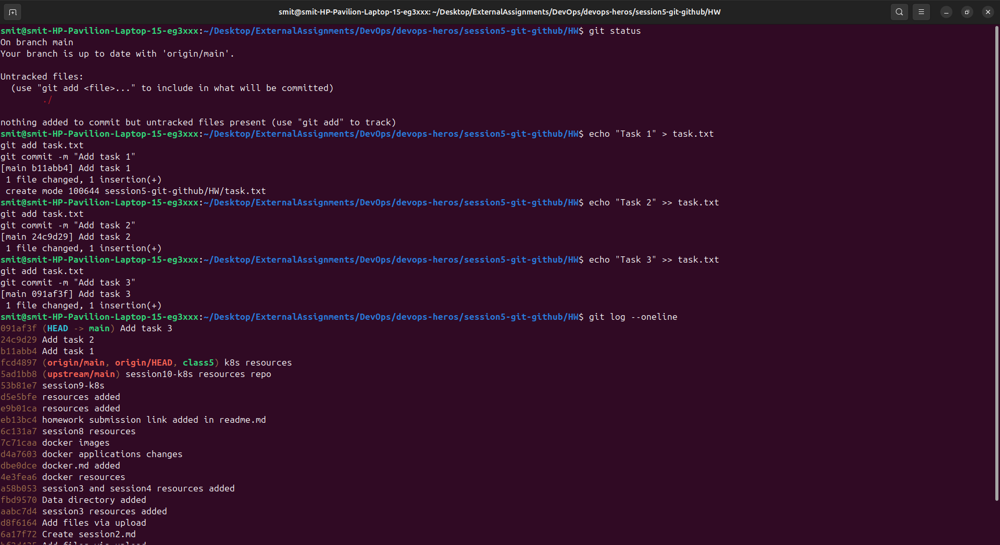
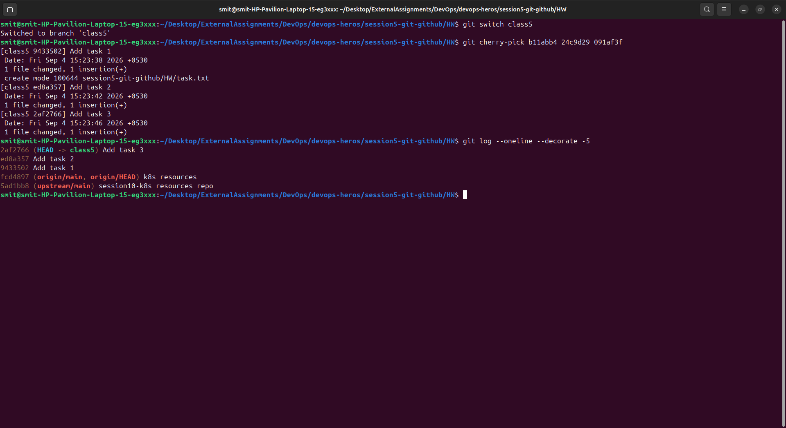

# Git Homework

## Task 1: git commit -a -m

I tested the difference between `git commit -m` and `git commit -a -m`.

### `git commit -m`

This command is used to commit changes that have already been added to the staging area.

Example:

```bash
git add file.txt
git commit -m "Update file"
```

### `git commit -a -m`

This command automatically stages changes to files that are already tracked by Git and commits them.

Example:

```bash
git commit -a -m "Update file"
```

I also tested it with a new file. A new untracked file is **not** included with `git commit -a -m`, so it needs to be added first:

```bash
git add newfile.txt
git commit -m "Add new file"
```

### Difference

`git commit -m` commits changes that are already staged.

`git commit -a -m` stages and commits changes to already tracked files at the same time.


From this homework, I understood the difference between `git commit -m` and `git commit -a -m`.

## Task 2:

### Making some commits in main



### Moving them into class5 branch

